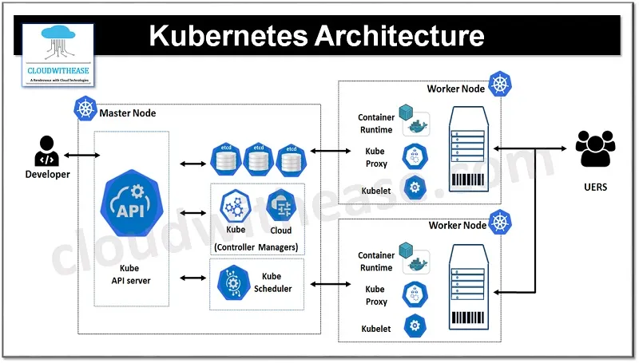
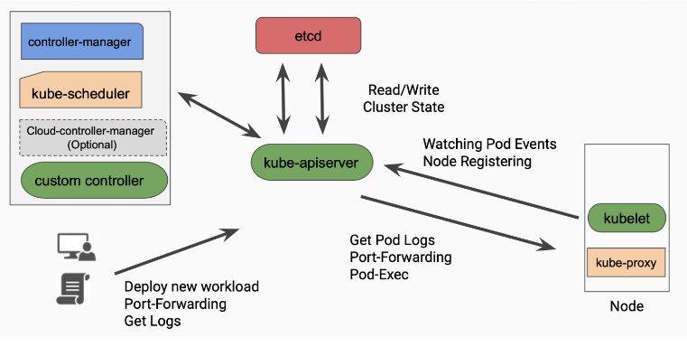
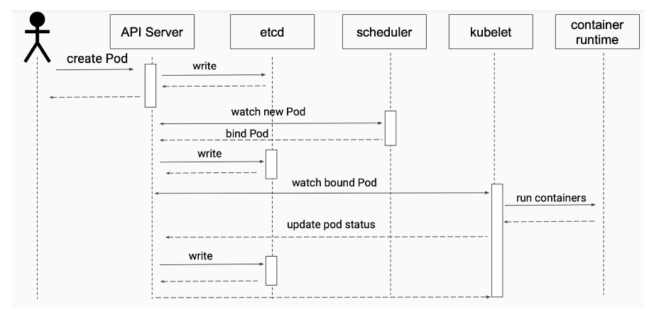

-------------------------------------------Agenda-----------------------------

Kubenetes: Là công cụ quản lý, điều phối container
Orchestration: đề cập đến việc quản lý vùng chứa và tự động hóa việc quản lý vùng chứa.

# Features:

- High availability: khả dụng cao
- Scalability: khả năng mở rộng về tài nguyên
- Self-healing : tự phục hồi
- Service discovery: Khám phá dịch vụ
- Load balancing: cân bằng tải
- Rollout & rollback: triển khai & khôi phục
- Extensibility: tính mở rộng về tính năng

# Master node - control plane

## Kube-controller manager
+ Giám sát và điều khiển cluster theo một trạng thái mong muốn thông qua apiserver. 
+ Đảm bảo trạng thái, số lượng mong muốn của Node
(call đến kube-apiserver -> kube scheduler để tạo thêm node)

##  Cloud-controller-manager
- Quản lý các tích hợp với điều khiển đám mây của một môi trường đám mây cụ thể
- Cài một số server của Cloud vào cluster

## Kube-scheduler
- Quản lý việc lập lịch triển khai các containerized workloads trên các node (đảm bảo chọn đúng node để chạy container)
- Khi có nhu cầu tạo pod thì Kube-scheduler chỉ định xem pod đó nên nằm ở Node nào

- Lập lịch: quyết định xem một Pod nên chạy trên node nào trong cluster.
- Tự động chọn node: tìm kiếm node thích hợp để lập lịch và triển khai các Pod

## Kube-apiserver
- là cánh cổng mà client dùng để tương tác với kubenetes. xử lý việc authentication, authorization, xác thực yêu cầu.
- Xử lý yêu cầu và lưu vào etcd

## Etcd(non sql)
- database của kubernetes lưu trữ trạng thái của cluster, lưu trữ dạng key values

# Node Components

## Kube-proxy
- Quản lý networking cho các container được triển khai trên các pod trong một cluster. 
- Đảm bảo việc tích hợp mạng và giao tiếp mạng cho các containerized.

- Container ở node này có thể gọi đến node khác (giống bridge network)

---
+ Network proxy: theo dõi các yêu cầu mạng đến các Pod và quản lý việc định tuyến các gói tin từ mạng đến các Pod cụ thể trong cluster.

+ IP vitualization: tạo ra một mô hình mạng ảo để ẩn đi các chi tiết cụ thể về mạng của các Pod và cho phép chúng giao tiếp bằng cách sử dụng địa chỉ IP ảo.

+ Service abstraction: quản lý các dịch vụ (Services) bằng cách cung cấp một IP và cổng ảo đại diện cho dịch vụ.

+ Load balancing: cân bằng tải các yêu cầu đến dịch vụ bằng cách chuyển tiếp các yêu cầu tới các Pods đích.

+ Network policies: tuân thủ các Network Policies được định nghĩa bởi người dùng để quy định quy tắc mạng giữa các Pods.

## Kubelet (nằm ở phần mạng của node)
- Là agent chạy trên từng node, đảm bảo container runing và report các thông tin về container cho kube-apiserver

---
+ Quản lý container: đảm bảo rằng các container chạy trên node đúng với mô tả được cung cấp bởi API Server.

+ Thực thi các tài liệu pod: lắng nghe các tài liệu Pod và chạy các container dựa trên thông tin trong chúng

+ Làm sạch container và pod: theo dõi trạng thái của các container và Pods và loại bỏ bất kỳ container hoặc Pod không còn cần thiết

+ Báo cáo trạng thái: định kỳ báo cáo trạng thái của node và các container tới API Server

+ Hỗ trợ các chức năng đặc biệt: thực hiện nhiều chức năng đặc biệt như đánh dấu node là không sẵn sàng nếu có sự cố, xác thực và ủy quyền các giao tiếp mạng, và hỗ trợ chạy các addon như kube-proxy.

## Container run time engine
- Thực hiện các tác vụ liên quan đến quản lý và chạy container

---
- Pod : được dùng để nhóm (group) và chạy một hoặc nhiều container lại với nhau trên cùng một worker node, những container trong một pod sẽ chia sẻ chung tài nguyên với nhau (ip). có thể chết bất cứ lúc nào

