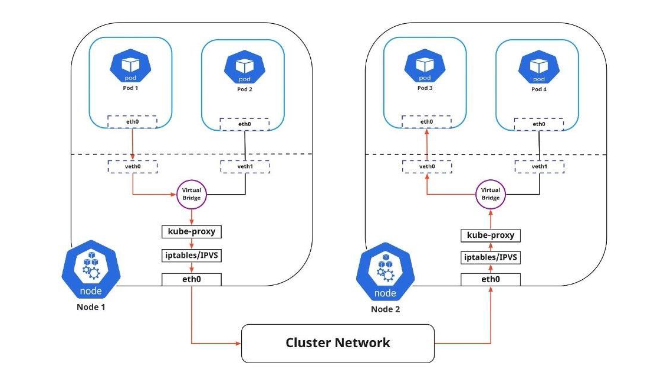

-------------------------------------------Agenda-----------------------------
cluster: tập hợp các host và tài nguyên chạy k8s
IPtable/ IPvs
# k8s networking model
- Mỗi pod đều có địa chỉ IP riêng (private IP - cluster-level): không cần tạo liên kết giữa các pod, không cần ánh sạ cổng container tới cổng host.
- NAT (Network Access Translation) không bắt buộc: các pod trên một node có thể giao tiếp với tất cả các pod trên các node mà không cần NAT
- Agents có toàn quyền truy cập: các agent trên một node có thể giao tiếp với tất cả các pod trên node đó

# Network Topology
- k8s có 4 loại network
    + container network: lắng nghe port
    + pod network: (ephemeral - pod dễ chết)
        + Các container trong pod lắng nghe một pod nào đó của riêng pod
        + Các container trong pod có thể goi thông qua localhost
    + node network: 
        + node nào cũng có kube-proxy (chỉ đường cho pod của node này biết pod của node khác nằm ở địa chỉ nào)
        + container runtime
        + kubelet (report thông tin về container cho kube-apiserver)
    + cluster network: 4 loại service

# Networking cluster

## Traffic đi trong node
- Khi một pod được tạo ra
    + Sẽ được gán 1 private IP, 1 card mạng (1)
    + Container runtime sẽ tạo Vitual internet, card mạng(2) giống card(1), hoạt động ở layer 2 
    + card mạng (2) sẽ copy traffic của card(1) và forward đến vitual bride network
    + Vitual bridge sẽ tìm những pod khác chứa destination và gửi đến IP pod khác
- Vitual internet: lắng nghe traffice trong pod
- Vitual bridge làm việc forward trafice đến một địa chỉ MAC (Media Access Control Address) khác

Vitual traffice: lắng nghe traffice trong pod, forward traffic trong pod

## Traffice đi ngoài node (kube-proxy)
- Sử dụng IP table để điều hướng traffice đến địa chỉ cần đến bên ngoài node

# Container-to-container networking
- Hai container(trong 1 pod) có dùng địa chỉ IP, các ứng dụng bên trong có thể lắng nghe cổng trên cùng một địa chỉ IP, và có thể kết nối thông qua localhost.
- Hai container không thể nghe cùng một cổng. đây là một hạn chế, giống với việc chạy nhiều tiến trình trên một máy chủ
- Init container sẽ chạy trước để khởi tạo network

# Pod Networking (Pod-to-Pod)
- Mọi node đều được chỉ định phạm vi IP CIDR cho pod. đảm bảo rằng mọi pod đều có địa chỉ IP duy nhất.
- Giao tiếp giữa các pod sử dụng địa chỉ IP thực

# Pod networking
• Pod có thể cần tăng hoặc giảm quy mô tùy theo nhu cầu
• Pod có thể được tạo lại trong trường hợp ứng dụng gặp sự cố hoặc lỗi node

=> những sự kiện này kiến địa chỉ IP của pod thay đổi

# Discovering Services (DNS)
- Kubernetes có thể tùy ý sử dụng DNS để tránh phải mã hóa cứng địa chỉ Service’s cluster IP address vào ứng dụng của bạn

# IPtable (chuyển hướng gói tin)
- IPtables (Internet Protocol tables) 
    + Là một tiện ích trong hệ thống Linux dùng để quản lý tường lửa (firewall) và các quy tắc liên quan đến việc chuyển hướng (routing) gói tin trên mạng.
    + Là một phần quan trọng của hệ thống bảo mật Linux và cho phép bạn kiểm soát luồng dữ liệu trong và ra khỏi máy chủ hoặc mạng.

- IPtables
    + Kubernetes sử dụng IPtables để quản lý việc chuyển hướng gói tin 
    + Thiết lập các quy tắc bảo mật cho các container và Pod. 
    + Ví dụ, K8s sử dụng IPtables để tạo các quy tắc Network Address Translation (NAT) để cho phép các Pod trong cùng một mạng ảo (overlay network) giao tiếp với nhau, cũng như để quản lý quy tắc tường lửa.

- Cụ thể, IPtables trong Kubernetes có thể được sử dụng để:
    + Chuyển tiếp gói tin từ ngoài cluster đến các Pod và dịch vụ (Service) trong cluster.
    + Xây dựng quy tắc tường lửa để kiểm soát luồng dữ liệu vào và ra khỏi các Pod.
    + Thực hiện chuyển hướng (routing) gói tin giữa các Pods và dịch vụ trên cùng một node hoặc giữa các node trong cluster.
    + Quản lý các quy tắc liên quan đến Network Policy, cho phép bạn định rõ cách Pod trong mạng ảo tương tác với nhau.

- IPtables là một trong những thành phần cốt lõi giúp Kubernetes quản lý mạng và bảo mật trong môi trường containerized.
